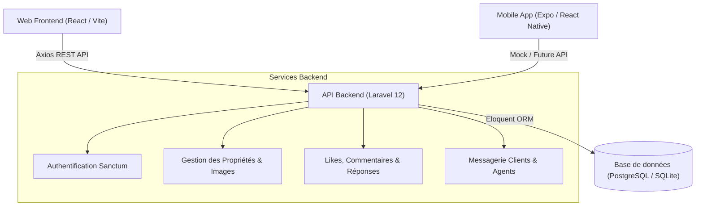

# Immo-Prestige

**Immo-Prestige** est une solution complète de gestion et de publication d'annonces immobilières haut de gamme. Ce projet regroupe une architecture moderne composée d'un backend d'API en Laravel, d'une interface d'administration et client en React/Vite, et d'un prototype d'application mobile en React Native (Expo).

---

## Architecture Globale



---

## Structure du Projet

Le dépôt est découpé en trois sous-projets principaux :

```
immo-Prestige/
├── backend/            # API REST construite avec Laravel 12
│   ├── app/            # Modèles, Contrôleurs, Resources & Requêtes
│   ├── database/       # Migrations, Seeders & Factories (SQLite par défaut)
│   ├── routes/         # Définitions des routes d'API
│   └── composer.json   # Dépendances PHP
│
├── frontend/           # Interface Web Client et Administration (React + Vite)
│   ├── src/
│   │   ├── components/ # Composants UI réutilisables (Shadcn / DaisyUI)
│   │   ├── pages/      # Pages (Propriétés, Auth, Profil, Home)
│   │   └── services/   # Services de communication avec le Backend (Axios)
│   └── package.json    # Dépendances Node.js (React 19, Tailwind CSS 4)
│
└── mobile/             # Prototype d'application mobile (Expo + React Native)
    ├── app/            # Système de routage Expo Router ((tabs), auth)
    ├── components/     # Composants d'interface (Flux de posts, cartes)
    └── package.json    # Dépendances Expo & React Native
```

---

## 1. Backend (Laravel 12)

Le backend fournit toutes les API sécurisées nécessaires au fonctionnement des plateformes Web et Mobiles via **Laravel Sanctum**.

### Prérequis

- **PHP** >= 8.2
- **Composer**
- **SQLite** (activé dans votre configuration PHP)

### Installation & Lancement

1.  Rendez-vous dans le dossier backend :
    ```bash
    cd backend
    ```
2.  Installez les dépendances et configurez l'environnement via le script automatisé :

    ```bash
    composer run setup
    ```

    _Ce script se chargera d'installer les dépendances, de générer la clé d'application, de créer la base de données SQLite et de lancer les migrations._

3.  Exécutez le seeder pour remplir la base de données de test :

    ```bash
    php artisan db:seed
    ```

4.  Lancez le serveur de développement :
    ```bash
    composer run dev
    ```
    _Ce script lance simultanément le serveur de développement PHP, le traitement des files d'attente (queue:listen) et le serveur Vite pour les assets._

### Comptes de Test (Générés par le Seeder)

Le seeder génère automatiquement les comptes d'agences suivants (mot de passe : `passer123`) :

- **Agence 1** : `tine@gmail.com`
- **Agence 2** : `aba@gmail.com`
- Le seeder génère également **100 utilisateurs normaux** (rôle: `user`) ainsi que 15 propriétés par agence, accompagnées d'images, de likes et de commentaires.

---

## 2. Frontend Web (React 19 + Vite 7)

L'application Web permet aux utilisateurs de naviguer parmi les annonces et aux agences de gérer leur catalogue de propriétés.

### Prérequis

- **Node.js** (LTS recommandé)
- **npm** ou **yarn**

### Installation & Lancement

1.  Rendez-vous dans le dossier frontend :
    ```bash
    cd frontend
    ```
2.  Installez les dépendances :
    ```bash
    npm install
    ```
3.  Démarrez le serveur de développement :
    ```bash
    npm run dev
    ```
4.  L'application est accessible par défaut sur `http://localhost:5173`. Elle communique avec l'API Laravel sur `http://localhost:8000/api`.

### Fonctionnalités Clés

- **Authentification complète** (Connexion, Inscription utilisateur et Inscription agence).
- **Tableau de bord Agence** (`PropertiesTable`) pour la gestion (Ajout, Édition, Suppression) de ses biens.
- **Détails des propriétés** : Vue détaillée complète incluant la galerie d'images et les détails techniques (surface, pièces, prix, localisation).

---

## 3. Application Mobile (Expo + React Native)

L'application mobile est un prototype de flux d'actualités immobilières moderne conçu avec Expo Router et NativeWind (Tailwind CSS sur React Native).

### Prérequis

- **Expo Go** installé sur votre smartphone (iOS/Android) ou un émulateur configuré.

### Installation & Lancement

1.  Rendez-vous dans le dossier mobile :
    ```bash
    cd mobile
    ```
2.  Installez les dépendances :
    ```bash
    npm install
    ```
3.  Démarrez le serveur de développement Expo :
    ```bash
    npm run start
    ```
4.  Scannez le QR Code affiché dans votre terminal avec l'application Expo Go pour ouvrir le projet sur votre appareil.

### Fonctionnalités Clés

- **Flux de publications** (`PostCard.tsx`) avec un affichage des biens immobiliers, likes interactifs en local et espace de commentaires (modale).
- **Système de Thème** : Mode Sombre (Dark Mode) commutable dans l'onglet Paramètres.
- **Navigation par Onglets** : Accueil, Propriétés, Messages, Agence, Paramètres.
- _Note : Actuellement, l'application mobile utilise des données fictives (mock data) pour l'affichage._

---
